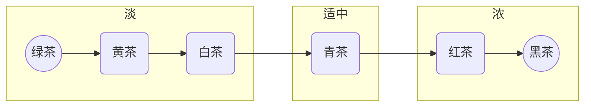

---
Title | 饮食 茶
-- | --
Created @ | `2023-02-09T16:02:21Z`
Updated @| `2023-06-04T14:22:14Z`
Labels | ``
Edit @| [here](https://github.com/junxnone/shi/issues/40)

---
## 茶的分类
- 绿茶
- 黄茶
- 白茶
- 青茶
- 红茶
- 黑茶

### 按照 `汤色/味道` 排序

