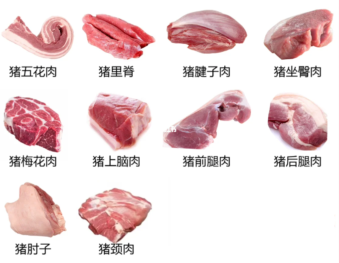
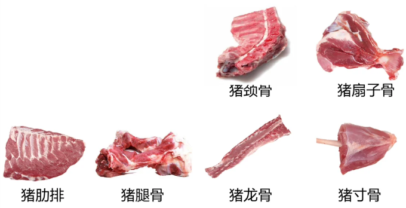
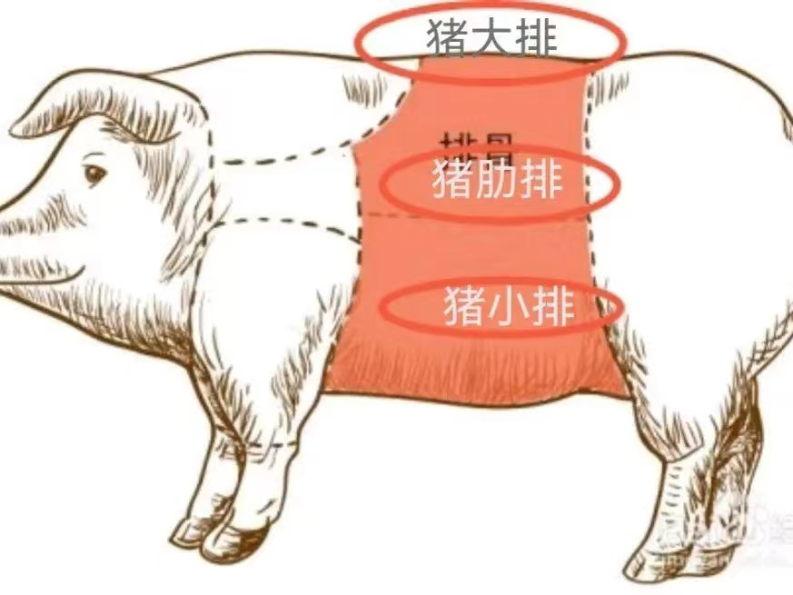

-----

| Title     | 食材 肉类 猪肉                                          |
| --------- | ------------------------------------------------- |
| Created @ | `2023-02-17T15:58:26Z`                            |
| Updated @ | `2023-06-04T14:37:42Z`                            |
| Labels    | \`\`                                              |
| Edit @    | [here](https://github.com/junxnone/shi/issues/16) |

-----

# 猪肉

  - 国人食用最广泛的肉类，研究的吃法也最广博

## 分类

### 肉分类

  - 五花肉
  - 里脊肉
  - 腱子肉
  - 上脑肉
  - 前腿肉
  - 后腿肉
  - 肘子
  - 梅花肉
  - 左臀肉
  - 颈肉

### 骨分类

  - 龙骨
  - 腿骨
  - 颈骨
  - 扇子骨
  - 肋排
  - 寸骨

## 肋排 & 大排 & 小排

  - 大排的部位在排骨的上端，连接里脊肉和背脊肉，也叫作肉排
  - 猪肋排也就是猪的肋骨部分，位于胸腔的地方，成片状
  - 猪腹腔靠近肚腩的地方，这部分的排骨叫作小排，在肋排的下边

