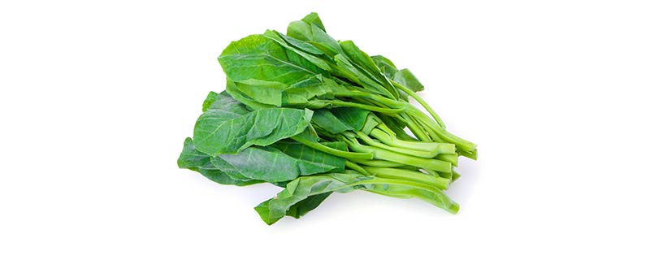
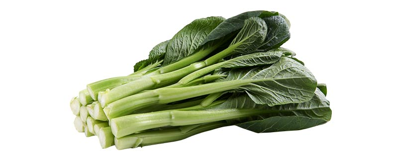

-----

| Title     | 菜谱 白灼菜心                                           |
| --------- | ------------------------------------------------- |
| Created @ | `2023-03-13T15:12:42Z`                            |
| Updated @ | `2023-06-04T14:16:47Z`                            |
| Labels    | \`\`                                              |
| Edit @    | [here](https://github.com/junxnone/shi/issues/27) |

-----

# 白灼芥兰/菜心

  - 芥兰/菜心
  - 生抽
  - 蒜沫
  - 藤椒油(可选)

## 步骤

  - 起锅烧水，煮沸
  - 芥兰/菜心 放入水中煮熟后摆盘
      - 可以先放茎部，再放叶子
  - 锅中倒入生抽, 藤椒油少许，少许水，烧开
  - 倒入蒜沫煮沸
  - 将料汁浇入盘中

## 如何区别芥兰和菜心

xx | 芥兰 | 菜心 图片 |
 |
 叶子 |
芥兰边缘多波浪 | 菜心叶子椭圆形 口感 | 芥兰口感脆爽，微苦 | 菜心柔嫩 青甜
